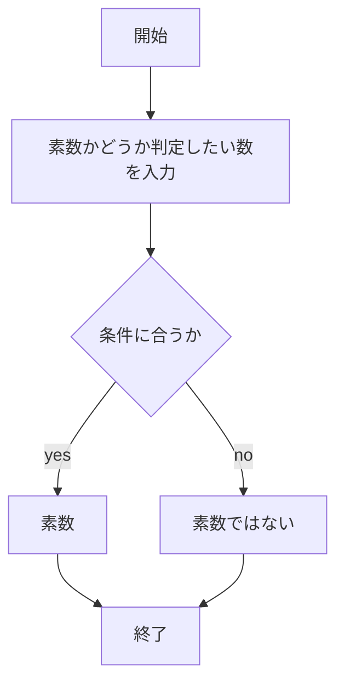

# webpro_06
2024/11/16

## ファイル一覧
ファイル名 | 説明
-|-
app5.js | プログラム本体
public/prime_number.html | 素数判定の開始画面
views/prime_number.ejs|素数判定のテンプレートファイル
public/plus.html | 足し算の開始画面
views/plus.ejs|足し算のテンプレートファイル

## 素数判定プログラムについて

このプログラムは，任意の整数が素数かどうか判別するプログラムである．

### 素数判定の仕様
1. ```app5.js```を起動する
1. Webブラウザで http://localhost:8080/prime_number にアクセスする
1. 素数かどうか判定したい数を入力する

### プログラムについて
```javascript
if (hand <= 1){
    //1以下の数字を素数ではないと判定
    cpu = '素数ではありません';
  }
  if (hand % 2 === 0 && hand !=2){
    //2以外の偶数を素数ではないと判定
    cpu = '素数ではありません';
  } else{
    cpu = '素数です';
    let i = 3;
    while (i <= Math.sqrt(hand)) {
    //判定したい数nが素数ではない時，√n以下で割り切れる法則を用いて，判定する
    //割り切れたら，素数ではないと判定．ループを終了
      if (hand % i === 0){
        cpu = '素数ではありません';
        break;
      }
      i += 2;
    }
  }
  if (hand === 2) {
    //2を素数と判定
    cpu = '素数です';
  }
```

### フローチャート



## 足し算プログラムについて

このプログラムは，任意の２つの数の和を求めるプログラムである．

### 足し算の仕様
1. ```app5.js```を起動する
1. Webブラウザで http://localhost:8080/plus にアクセスする
1. 足したい数字をを入力する

