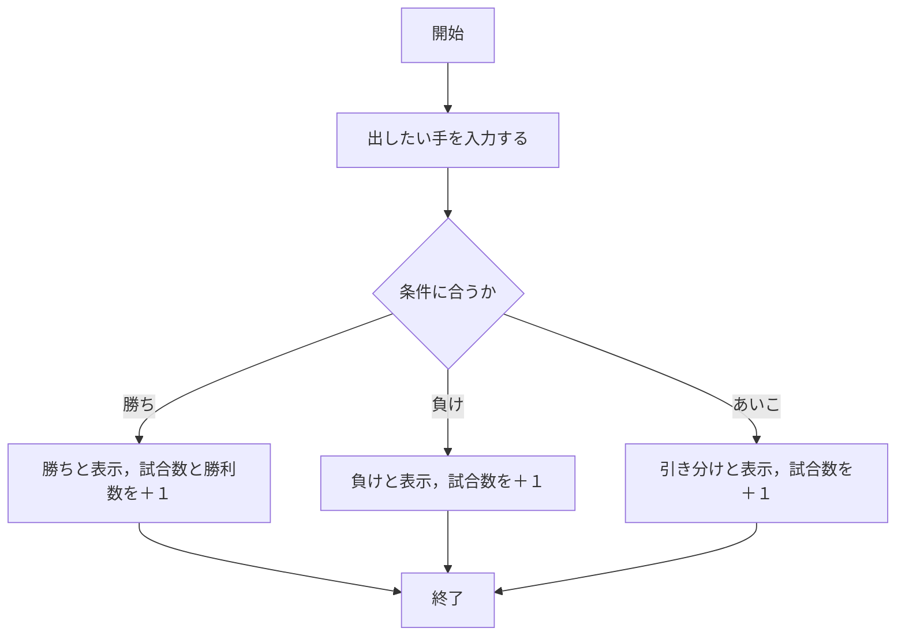
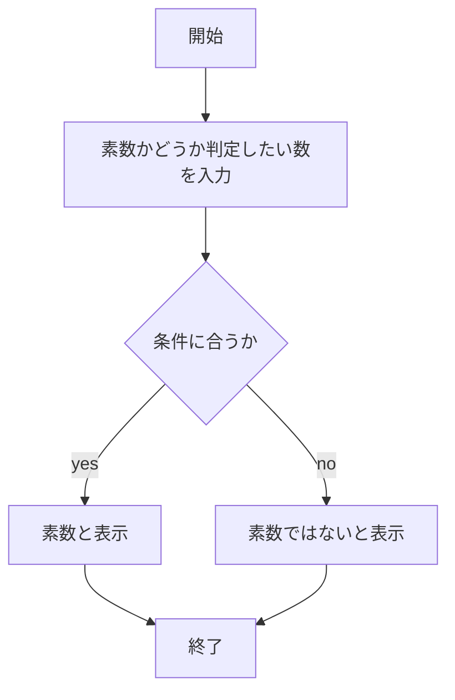

# webpro_06
2024/11/16

## ファイル一覧
ファイル名 | 説明
-|-
app5.js | プログラム本体
views/show.ejs|メッセージ表示のテンプレートファイ
views/icon.ejs|画像表示のテンプレートファイ
views/luck.ejs|おみくじのテンプレートファイ
public/janken.html | じゃんけんの開始画面
views/janken.ejs|じゃんけんのテンプレートファイル
views/prime_number.ejs|素数判定のテンプレートファイル
views/plus.ejs|足し算のテンプレートファイル

# 画像表示プログラムについて

このプログラムは，画像を表示するプログラムである．

以下に，画像を表示するプログラムを示す．

```javascript
app.get("/icon", (req, res) => {
  res.render('icon', { filename:"./public/Apple_logo_black.svg", alt:"Apple Logo"});
});
```
### 画像表示プログラムの実行方法

1. ```app5.js```を起動する
1. Webブラウザで http://localhost:8080/icon にアクセスする

# おみくじプログラムについて

このプログラムは，生成されたランダムな数に応じて運を決定するプログラムである．
以下に，各数字の運勢を割り当てるプログラムを示す．
```javascript
const num = Math.floor( Math.random() * 6 + 1 );
let luck = '';
if( num==1 ) luck = '大吉';
else if( num==2 ) luck = '中吉';
else if( num==3 ) luck = '小吉';
else if( num==4 ) luck = '吉';
else if( num==5 ) luck = '末吉';
else if( num==6 ) luck = '凶';
```

### おみくじのプログラムの実行方法

1. ```app5.js```を起動する
1. Webブラウザで http://localhost:8080/luck にアクセスする

# じゃんけんのプログラムについて

このプログラムは，コンピューターとじゃんけんをし，勝敗を記録するプログラムである．
以下に，コンピュータの出すランダムな手のプログラムを示す．
```javascript
  const num = Math.floor( Math.random() * 3 + 1 );
　let cpu = '';

  if( num==1 ) cpu = 'グー';
  else if( num==2 ) cpu = 'チョキ';
  else cpu = 'パー';
```
以下に，勝敗の判定のプログラムを示す．
```javascript
  let judgement = '';
  win = 0;
  total = 0;

  if( hand == 'グー' && cpu == 'チョキ'){
  judgement = '勝ち';
  win += 1;
  }
  else if( hand == 'パー' && cpu == 'グー' ){
  judgement = '勝ち';
  win += 1;
  }
  else if( hand == 'チョキ' && cpu == 'パー' ){
  judgement = '勝ち';
  win += 1;
  }
  else if( hand == cpu ){
    judgement = '引き分け';
  }
  else {
    judgement = '負け';
  }
  total += 1;
```
### じゃんけんのプログラムの実行方法

1. ```app5.js```を起動する
1. Webブラウザで http://localhost:8080/janken にアクセスする
1. 出したい手を入力する

### フローチャート



# 素数判定のプログラムについて

このプログラムは，任意の整数が素数かどうか判別するプログラムである．
以下に素数の判定方法のプログラムを示す．
```javascript
if (hand <= 1){
    //1以下の数字を素数ではないと判定
    cpu = '素数ではありません';
  }
  if (hand % 2 === 0 && hand !=2){
    //2以外の偶数を素数ではないと判定
    cpu = '素数ではありません';
  } else{
    cpu = '素数です';
    let i = 3;
    while (i <= Math.sqrt(hand)) {
    //判定したい数nが素数ではない時，√n以下で割り切れる法則を用いて，判定する
    //割り切れたら，素数ではないと判定．ループを終了
      if (hand % i === 0){
        cpu = '素数ではありません';
        break;
      }
      i += 2;
    }
  }
  if (hand === 2) {
    //2を素数と判定
    cpu = '素数です';
  }
```

### 素数判定のプログラムの実行方法

1. ```app5.js```を起動する
1. Webブラウザで http://localhost:8080/prime_number にアクセスする
1. 素数かどうか判定したい数を入力する

### フローチャート



# 足し算のプログラムについて

このプログラムは，任意の２つの数の和を求めるプログラムである．

### 足し算のプログラムの実行方法
1. ```app5.js```を起動する
1. Webブラウザで http://localhost:8080/plus にアクセスする
1. 足したい数字をを入力する
