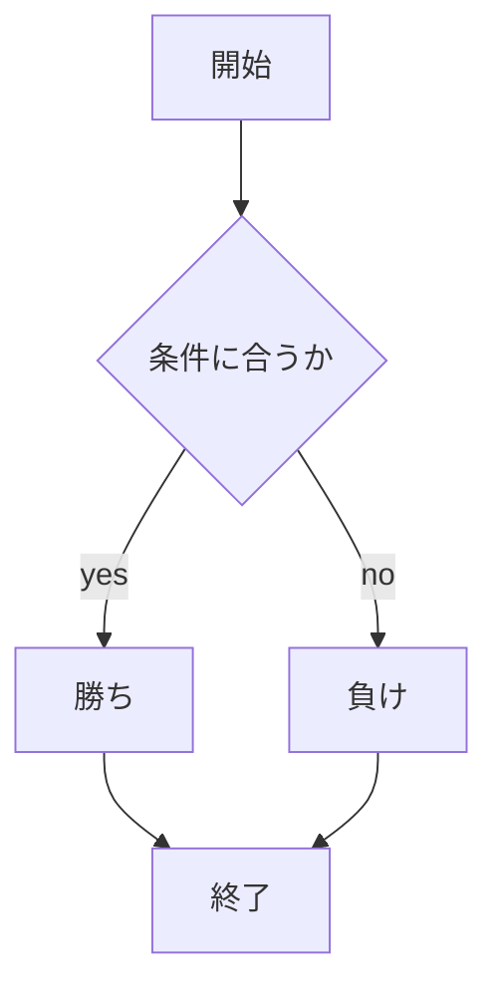

# webpro_06
2024/10/29
## このプログラムについて
```javascript
console.log('hello')
```
## ファイル一覧
ファイル名 | 説明
-|-
app5.js | プログラム本体
public/janken.html | じゃんけんの開始画面
views/janken.ejs|ジャンケンのテンプレートファイル

## 仕様
1. app5.js を起動する
1. Webブラウザでlocalhost:8080/public/janken.htmlにアクセスする
1. 自分の手を入力する

## フローチャート

```mermaid
flowchartTD;
開始 --> 終了;
```

